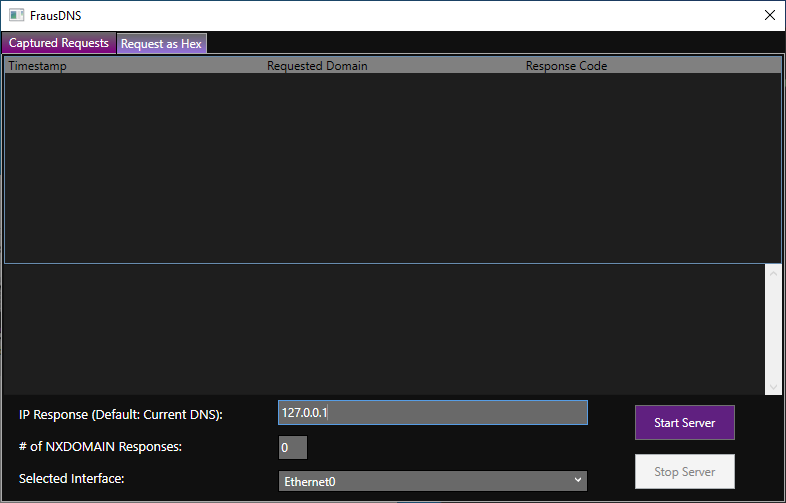
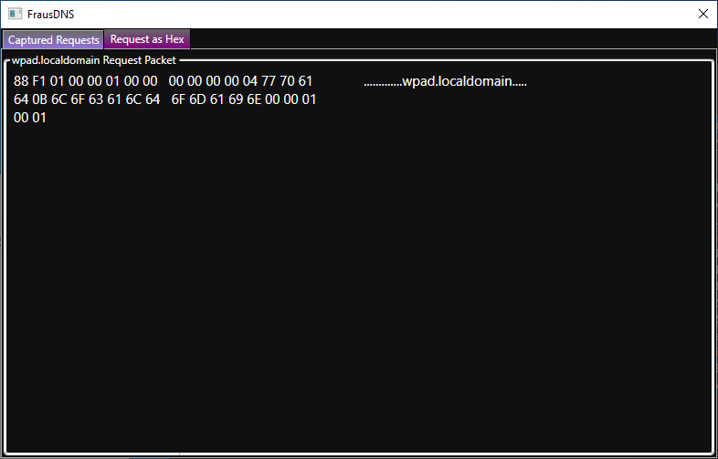

# FrausDNS
Tool designed to capture DNS requests made from the local machine and spoof responses with a specified IP address. 
Original intention is to isolate malware and observe its network activity.

---

## Notes
  - ***Must be run with elevated privileges (run as administrator)***.
  - The local DNS server on the local machine will be changed to the loopback address (127.0.0.1). 
  - The DNS Server Search Order will be reset during execution. 
  - The server must be stopped to reset the DNS Server Search Order.
  - Original search order settings are not preserved.
  
---

## Using FrausDNS

### Capture Window 

Tab displayed that shows all DNS requests that are made by the local machine. Includes a console output window to show messages from the application. Allows the user to change the reply IP, number of NXDomain responses, and the affected interface. 

Changing the value inside the *Dns Reply IP* textbox will change the IP address response that the application will return to any DNS request. This must be in the form of *xxx.xxx.xxx.xxx*. The application will attempt to default this to the local machine itself using the IP address on the first network interface that is detected.

Changing the value inside the *NXDOMAIN's* textbox will change the number of NXDOMAIN (response code 3) responses that will be sent per domain. Intention for this is to allow malware to cycle through its different domains if it has them. Input has to be an integer. 

Changing the value inside the *Selected Interface* dropdown will change the affected network interface on the machine that will have it's DNS Server Search Order set to the loopback address.

After modifying the options to the user's preferences, then press the *Start Server* button. 

### While Running

Once the button is pressed, then the server will start listening for DNS requests and responds to them using the User-specified IP address. 

If the number of NXDOMAIN responses is greater than 0, then there will be that many NXDOMAIN entries in the capture window per domain as they come in.

The console will summarize the various settings that were set. Captured DNS requests will be logged into the capture window with their timestamp, requested domain and the response code that the server gave back. If you want to look at a specific DNS request and its data that was sent, you can double click an entry and the Hex View will be shown. Also, you can single click and manually click the Hex View Tab.

### DNS Hex View

Tab displayed that will show the hex bytes that were sent to the DNS server.

The hex bytes on the left represent the data in the request. The string on the right side of the screen is a simplified readable version of the hex bytes. It is shown in the form of alphanumeric characters (A-Z, a-z, 0-9) with any other characters being represented as ".". 

Once finished, the *Stop Server* button must be pressed to stop the server to clear the DNS Server Search Order. 

---

### Running NXDOMAIN Example

There will be 1 NXDOMAIN response for each domain requested.
