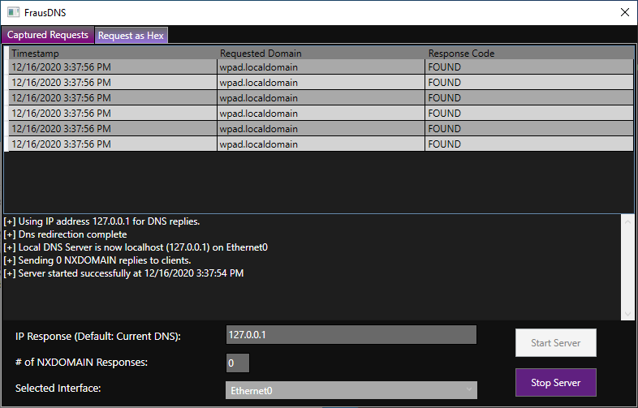
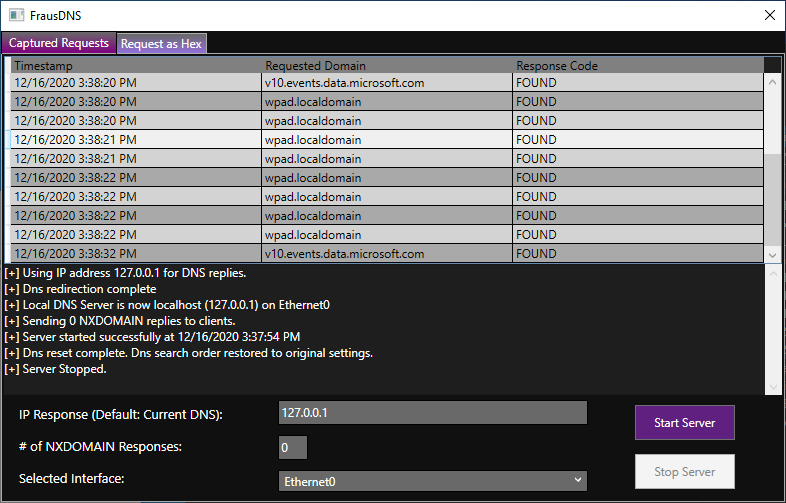

# FrausDNS
Windows tool designed to capture DNS requests made from the local machine and spoof responses with a specified IP address. 
Original intention is to isolate malware and observe its network activity. FrausDNS serves as an alternative to ApateDnS, which is obosolete.

---

## Notes
  - ***Must be run with elevated privileges (run as administrator)***.
  - The local DNS server on the local machine will be changed to the loopback address (127.0.0.1). 
  - The DNS Server Search Order will be reset during execution. 
  - The server must be stopped to reset the DNS Server Search Order.
  - Original search order settings are not preserved.
  - The loopback address shown is optional. Solely used for demonstration.
---

## Using FrausDNS

FrausDNS allows the user to change the reply IP, number of NXDomain responses, and the affected network interface. 

*IP Response*: IP address that will be returned to any DNS request. Defaults to current DNS.

*# of NXDOMAIN Responses*: Number of NXDOMAIN responses sent per domain.

*Selected Interface*: Network interface that will have its DNS Server Search Order affected.

After modifying the options to the user's preferences, then press the *Start Server* button. 

### Captured Requests 

This tab shows all DNS requests that are made by the local machine. Includes a console output window to show messages from the application. 

### While Running

Once the button is pressed, then the server will start listening for DNS requests and responds to them using the user-specified IP address. 

If the number of NXDOMAIN responses is greater than 0, then there will be that many NXDOMAIN entries in the capture window per domain as they come in.

The console will summarize the various settings that were set. Captured DNS requests will be logged into the capture window with their timestamp, requested domain and the response code that the server gave back. If you want to look at a specific DNS request and its data that was sent, you can double click an entry and the hex will be shown. Also, you can single click and manually click the *Request as Hex* Tab.

### Request as Hex

This tab shows the hex bytes that were sent to the DNS server.

The hex bytes on the left represent the data in the request. The string on the right side of the screen is a simplified readable version of the hex bytes. It is shown in the form of alphanumeric characters (A-Z, a-z, 0-9) with any other characters being represented as ".". 

Once finished, the *Stop Server* button must be pressed to stop the server to clear the DNS Server Search Order. 

---

### Running NXDOMAIN Example

There will be 1 NXDOMAIN response for each domain requested.
